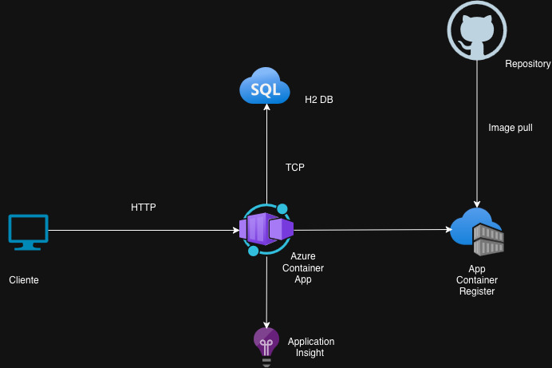

# BFF Digital Factory Challenge 🚀

[](https://www.oracle.com/java/)
[](https://spring.io/projects/spring-boot)
[](https://gradle.org/)
[](https://www.docker.com/)
[](https://portal.azure.com/)

## 📋 Descripción

Backend For Frontend (BFF) desarrollado como parte del Digital Factory Challenge. Este proyecto implementa una arquitectura moderna utilizando Spring WebFlux para operaciones reactivas y Spring Boot para una configuración simplificada.

## Funcionalidades

## 🛠️ Tecnologías Utilizadas

- **Java 17** - Última versión LTS de Java
- **Spring Boot 3.x** - Framework principal
- **Spring WebFlux** - Programación reactiva
- **H2** - Base de datos en memoria
- **Lombok** - Reducción de código boilerplate
- **Gradle** - Gestión de dependencias y construcción
- **Docker** - Containerización de la aplicación
- **Application Insights** - Monitoreo y telemetría

## 📁 Estructura del Proyecto
Se eligio una arquitectura hexagonal diviendo en tres carpetas principales:
- **application** - Donde esa la logica de negocio
- **domain** - Donde se definen los modelos de dominio
- **infrastructure** - Donde se definen los adaptadores de infraestructura
```plaintext
├── src/
│   ├── main/
│   │   ├── java/
│   │   │   └── pe/com/scotiabank/bff/digital/factory/challenge/
│   │   │       ├── shared          # Clases, enums, config comunes
│   │   │       ├── student/        # Dominio, use cases, adapters
│   │   │       │    ├── application
│   │   │       │    ├── domain
│   │   │       │    └── infrastructure
│   │   │       └── Application.java # Clase principal
│   │   └── resources/
│   │       ├── application.properties
│   │       ├── applicationinsights-dev.json
│   │       ├── bff-digital-factory-challenge-v1.0.properties
│   │       └── database.properties
│   └── test/                           # Tests unitarios con JUnit y Mockito
├── gradle/
├── build.gradle
├── settings.gradle
├── Dockerfile
└── README.md
```
## 📊 Arquitectura
Se eligio arquitectura en azure por que es mas escalable


## 🚀 Requisitos Previos

- Java JDK 17 o superior
- Gradle 8.x (o usar el wrapper incluido)
- Docker (opcional, para containerización)

## ⚙️ Instalación y Configuración

### 1. Clonar el repositorio

```bash
git clone <repository-url>
cd bff-digital-factory-challenge
```

### 2. Construir el proyecto

```shell
./gradlew build
```

### 3. Ejecutar la aplicación

```shell
./gradlew bootRun
```
O alternativamente:
```shell
java -jar build/libs/app.jar
```

### 🐳 Docker

#### Construir la imagen Docker

```shell
docker build -t bff-digital-factory-challenge .
```
### Ejecutar el contenedor
```shell
docker run -p 8080:8080 bff-digital-factory-challenge
```

## 🧪 Ejecutar Tests
```shell
./gradlew test
```

## Probar en ambiente productivo
```shell
curl --location 'https://containerapiscotiabankchallenge.jollyriver-3bf7b488.westus2.azurecontainerapps.io//challenge/students' \
--header 'Content-Type: application/json' \
--data '{
    "id": "1883b8ef-f0ab-4831-aeff-20221da17b22",
    "name": "bryan",
    "lastName": "rosas",
    "age": 10,
    "state": "ACTIVE"
}'
```

## 📊 Características Principales
- ✅ Arquitectura reactiva con Spring WebFlux
- ✅ Integración con Jakarta EE
- ✅ Uso de Lombok para código limpio
- ✅ Dockerizado y listo para despliegue
- ✅ Monitoreo con Application Insights
- ✅ Configuración moderna con Java 17

## 🔧 Configuración
La configuración de la aplicación se encuentra en:
- src/main/resources/application.properties

## 📡 Endpoints
| Endpoint                              | Método | Descripción                               |
|---------------------------------------|--------|-------------------------------------------|
| `/challenge/students` | `POST` | Crea un nuevo estudiante. |
| `/challenge/students`     | `GET`  | Lista estudiantes activos.                |
| `/swagger-ui/**`                      | `GET`  | Documentación interactiva API (Swagger).  |
| `/api-docs/**`                        | `GET`  | Esquema de documentación OpenAPI.         |

## 📊 Métricas personalizadas
sistema registra métricas para cada operación de estudiante usando Micrometer:

| Métrica| Descripción| Tag(s)|
|-------------------------------------|--------|-----------------------------------------|
| `student_create_total` | Total de intentos de creación de estudiante | `status (id_exists, id_not_exists). |

## 📄 Licencia
Este proyecto es parte del Digital Factory Challenge.

## 👤 Autor
**Bryan Rosas Quispe**
Ingeniero de Software

Desarrollado como parte del desafío técnico de Digital Factory.